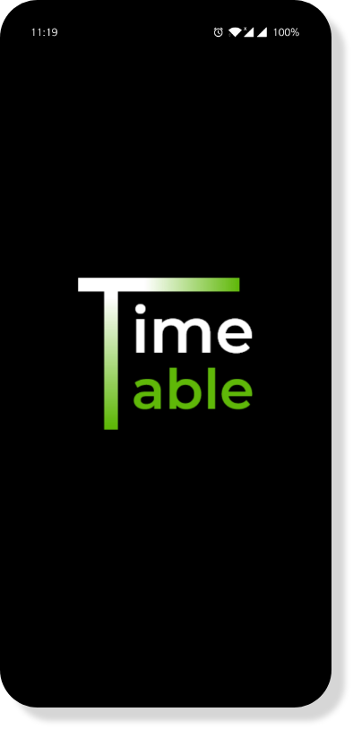
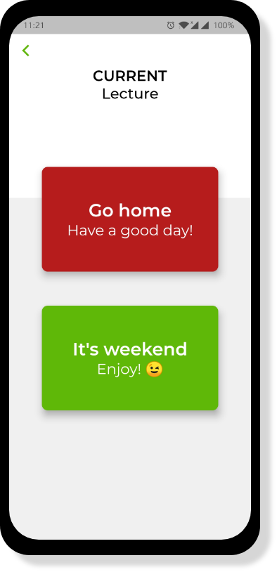
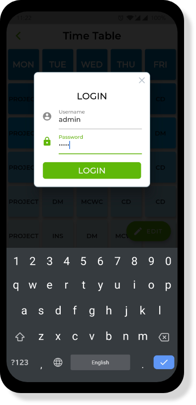
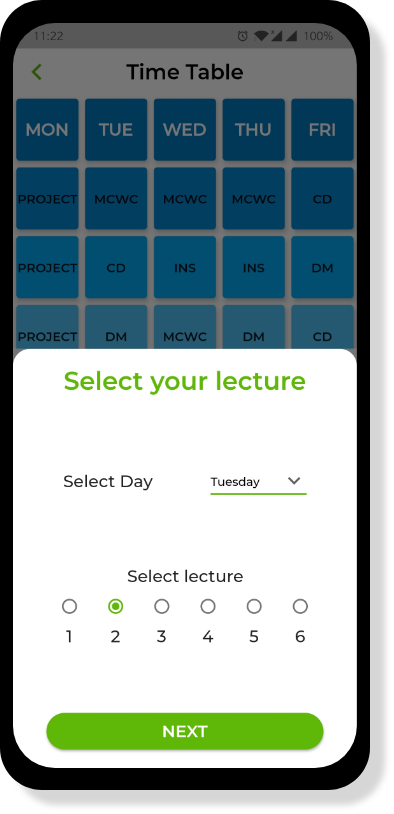
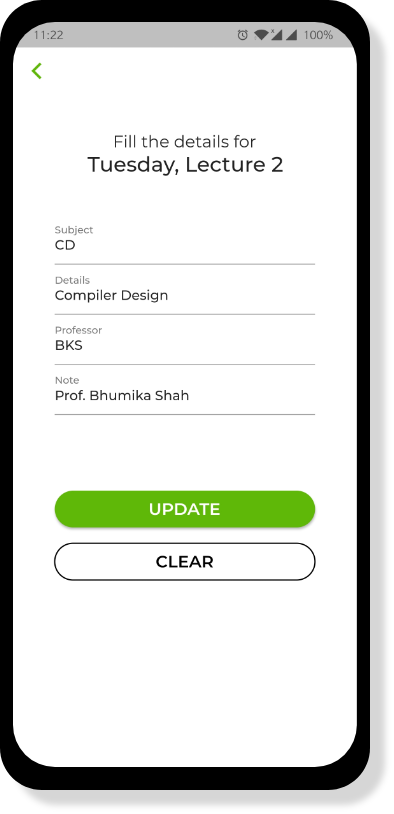
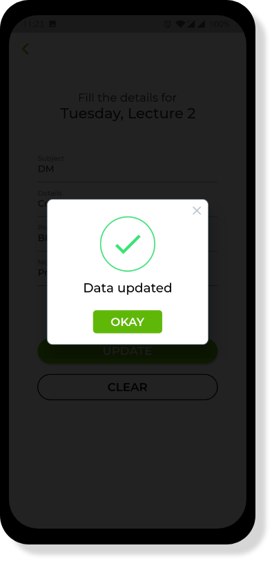

# Live Time Table App

- An app that provides live lecture information based on time of using app.
- It provides subject name and professor name with remarks.
- One can also edit any lecture details with valid credentials

## Screenshots

