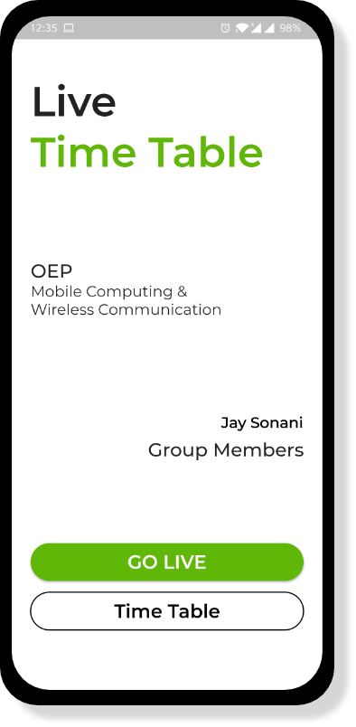
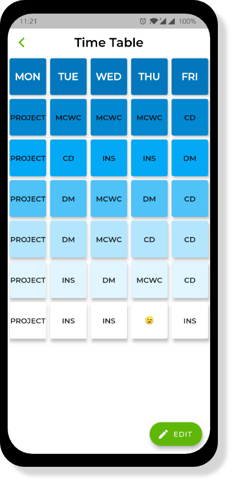

# Live Time Table App

- An app that provides live lecture information based on time of using app.
- It provides subject name and professor name with remarks.
- One can also edit any lecture details with valid credentials.

## Download APK

- Click <a href="https://github.com/JaySonani/Live-Time-Table/raw/master/ss/Live%20TimeTable.apk">here</a> to download the file.

## Screenshots

